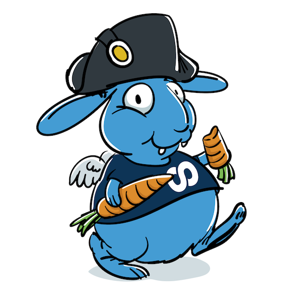

[](https://github.com/foomo/contentfulcommander/actions/workflows/pr.yml)
[](https://goreportcard.com/report/github.com/foomo/contentfulcommander)
[](https://coveralls.io/github/foomo/contentfulcommander?branch=main)
[](https://godoc.org/github.com/foomo/contentfulcommander)

<p align="center">
  
</p>

# Contentful Commander

A Go library for Contentful migrations that provides a high-level interface for working with Contentful spaces, entities, and performing bulk operations.

## Features

- **Unified Entity Interface**: Work with both Contentful entries and assets through a common interface
- **Space Model Caching**: Load and cache entire space models for efficient operations
- **Locale-Aware Operations**: Native support for Contentful's localization system with locale-specific field access
- **Type-Safe Field Access**: Specialized methods for different field types (string, float64, bool, references)
- **Reference Resolution**: Direct access to referenced entities with automatic broken reference handling
- **Asset-Specific Methods**: Dedicated methods for asset title, description, and file access
- **Flexible Filtering**: Filter entities by content type, publication status, timestamps, and custom criteria
- **Collection Operations**: Chain operations like filtering, mapping, grouping, and reducing
- **Migration Execution**: Execute batch operations with dry-run support and comprehensive error handling
- **Configuration Management**: Load configuration from environment variables or `.contentfulrc.json` files
- **Portable Design**: Only depends on `github.com/foomo/contentful` and standard library

## Quick Start

```go
package main

import (
    "log"
    
    "github.com/foomo/contentfulcommander/commanderclient"
)

func main() {
    // Load config from environment variables
    config := commanderclient.LoadConfigFromEnv()
    
    // Initialize ready-to-use client with logger and loaded space model
    client, logger, err := commanderclient.Init(config)
    if err != nil {
        log.Fatal(err)
    }
    
    // Filter entities
    entries := client.FilterEntities(
        commanderclient.FilterByContentType("product"),
        commanderclient.FilterPublished(),
    )
    
    // Process entities
    entries.ForEach(func(entity commanderclient.Entity) {
        logger.Info("Processing %s", entity.GetID())
    })
}
```

## Core Concepts

### Entity Interface

All Contentful entries and assets implement the `Entity` interface:

```go
type Entity interface {
    // Basic entity information
    GetID() string
    GetType() string          // "Entry" or "Asset"
    GetContentType() string   // Content type ID for entries
    GetCreatedAt() time.Time
    GetUpdatedAt() time.Time
    GetVersion() int
    IsPublished() bool
    GetPublishingStatus() string  // "draft", "published", or "changed"
    
    // Field access methods
    GetFields() map[string]any
    GetFieldValue(fieldName string, locale Locale) any
    GetFieldValueWithFallback(fieldName string, locale Locale, defaultLocale Locale) any
    
    // Type-safe field access (primarily for entries)
    GetFieldValueAsString(fieldName string, locale Locale) string
    GetFieldValueAsFloat64(fieldName string, locale Locale) float64
    GetFieldValueAsBool(fieldName string, locale Locale) bool
    
    // Reference handling
    GetFieldValueAsReference(fieldName string, locale Locale) *contentful.Entry
    GetFieldValueAsReferencedEntity(fieldName string, locale Locale) (Entity, bool)
    GetFieldValueAsReferences(fieldName string, locale Locale) []*contentful.Entry
    GetFieldValueAsReferencedEntities(fieldName string, locale Locale) *EntityCollection
    
    // Advanced field access
    GetFieldValueInto(fieldName string, locale Locale, target any) error
    
    // Entity-specific methods
    GetTitle(locale Locale) string
    GetDescription(locale Locale) string
    GetFile(locale Locale) *contentful.File
    
    // Utility methods
    SetFieldValue(fieldName string, locale Locale, value any)
    GetSys() *contentful.Sys
    IsEntry() bool
    IsAsset() bool
}
```

### Publishing Status

The library provides accurate publishing status detection based on Contentful's versioning system:

- **Draft**: `PublishedVersion == 0` (never been published)
- **Published**: `Version - PublishedVersion == 1` (current published version)
- **Changed**: `Version - PublishedVersion > 1` (has unpublished changes)

```go
entity := client.GetEntity("some-id")
status := entity.GetPublishingStatus() // "draft", "published", or "changed"
isPublished := entity.IsPublished()     // true only if status == "published"
```

The `MigrationClient` provides the main interface for working with Contentful spaces:

```go
// Initialize ready-to-use client
config := commanderclient.LoadConfigFromEnv()
client, logger, err := commanderclient.Init(config)
if err != nil {
    log.Fatal(err)
}

// Get entities (all return EntityCollection for consistency)
allEntities := client.GetAllEntities()
entries := client.GetEntries()
assets := client.GetAssets()
specificEntries := client.GetEntitiesByContentType("product")

// Filter entities
filtered := client.FilterEntities(
    commanderclient.FilterByContentType("product", "category"),
    commanderclient.FilterPublished(),
    commanderclient.FilterByUpdatedAfter(time.Now().AddDate(0, -1, 0)),
)
```

### Collection Operations

Collections provide powerful operations for working with groups of entities:

```go
collection := client.FilterEntities(filters...)

// Basic operations
count := collection.Count()
entities := collection.Get()
entity, exists := collection.GetByID("entity-id")

// Chaining operations
result := collection.
    Filter(commanderclient.FilterPublished()).
    Limit(100).
    Skip(50)

// Data extraction
ids := collection.ExtractIDs()
contentTypes := collection.ExtractContentTypes()
fieldValues := collection.ExtractFields("title")

// Grouping operations
contentTypeGroups := collection.GroupByContentType()
statusGroups := collection.GroupByPublishingStatus()
customGroups := collection.GroupBy(func(entity Entity) string {
    return entity.GetContentType()
})

// Counting operations
contentTypeCounts := collection.CountByContentType()
statusCounts := collection.CountByPublishingStatus()

// Statistics
stats := collection.GetStats()
fmt.Printf("Total: %d, Entries: %d, Assets: %d\n", 
    stats.TotalCount, stats.EntryCount, stats.AssetCount)

// Migration operations
updateOps := collection.ToUpdateOperations(map[string]any{
    "newField": "newValue",
})
publishOps := collection.ToPublishOperations()
deleteOps := collection.ToDeleteOperations()
```

## Field Access Methods

The library provides multiple ways to access field values, each optimized for different use cases:

### Basic Field Access

```go
// Get raw field value
value := entity.GetFieldValue("title", commanderclient.Locale("en"))

// Get field value with fallback to default locale
value := entity.GetFieldValueWithFallback("title", commanderclient.Locale("fr"), defaultLocale)
```

### Type-Safe Field Access

```go
// Get field as specific types (returns zero value if not found or wrong type)
title := entity.GetFieldValueAsString("title", commanderclient.Locale("en"))
price := entity.GetFieldValueAsFloat64("price", commanderclient.Locale("en"))
isActive := entity.GetFieldValueAsBool("isActive", commanderclient.Locale("en"))
```

### Reference Handling

```go
// Get reference as contentful.Entry
reference := entity.GetFieldValueAsReference("category", commanderclient.Locale("en"))

// Get actual referenced entity (resolves the reference)
if categoryEntity, found := entity.GetFieldValueAsReferencedEntity("category", commanderclient.Locale("en")); found {
    categoryTitle := categoryEntity.GetFieldValueAsString("title", commanderclient.Locale("en"))
}

// Get multiple references as slice
references := entity.GetFieldValueAsReferences("tags", commanderclient.Locale("en"))

// Get multiple referenced entities as collection (broken references automatically skipped)
tagEntities := entity.GetFieldValueAsReferencedEntities("tags", commanderclient.Locale("en"))
tagEntities.ForEach(func(tagEntity commanderclient.Entity) {
    fmt.Printf("Tag: %s\n", tagEntity.GetFieldValueAsString("name", commanderclient.Locale("en")))
})
```

### Advanced Field Access

```go
// Unmarshal field value directly into a struct (entries only). Useful for JSON/Object fields.
type Query struct {
    Operation string        `json:"operation"`
    Elements []ElementType  `json:"elements"`
}

var myQuery Query
if err := categoryEntity.GetFieldValueInto("catalogueQuery", commanderclient.Locale("en"), &myQuery); err != nil {
    log.Printf("Error: %v", err)
}
```

### Entity-Specific Methods

```go
// Get title (uses content type display field for entries, asset title for assets)
title := entity.GetTitle(commanderclient.Locale("en"))

// Get description (assets only, returns empty string for entries)
description := entity.GetDescription(commanderclient.Locale("en"))

// Get file information (assets only, returns nil for entries)
file := entity.GetFile(commanderclient.Locale("en"))
if file != nil {
    fmt.Printf("File: %s (%s)\n", file.Name, file.ContentType)
    fmt.Printf("URL: %s\n", file.URL)
}
```

## Locale Support

### Working with Locales

```go
// Get space locales
locales := client.GetLocales()
defaultLocale := client.GetDefaultLocale()

// Access field values for specific locales
entity := entries[0]
value := entity.GetFieldValue("title", commanderclient.Locale("en"))

// Access field values with fallback to default locale
value := entity.GetFieldValueWithFallback("title", commanderclient.Locale("fr"), defaultLocale)

// Set field values for specific locales
entity.SetFieldValue("title", commanderclient.Locale("de"), "Deutscher Titel")

// Get all fields (always locale maps)
fields := entity.GetFields()
```

### Locale-Aware Filtering

```go
// Filter by field value for a specific locale
englishEntries := client.FilterEntities(
    commanderclient.FilterByFieldValueWithLocale("title", commanderclient.Locale("en"), "Welcome"),
)

// Filter by field value with fallback to default locale
entriesWithWelcome := client.FilterEntities(
    commanderclient.FilterByFieldValueWithFallback("title", commanderclient.Locale("fr"), defaultLocale, "Welcome"),
)

// Filter by locale availability
multiLocaleEntries := client.FilterEntities(
    commanderclient.FilterByLocaleAvailability([]commanderclient.Locale{
        commanderclient.Locale("en"),
        commanderclient.Locale("de"),
    }),
)
```

### Locale-Aware Operations

```go
// Extract field values for a specific locale
collection := commanderclient.NewEntityCollection(entries)
englishTitles := collection.ExtractFieldValues("title", commanderclient.Locale("en"))

// Extract field values with fallback to default locale
frenchTitles := collection.ExtractFieldValuesWithFallback("title", commanderclient.Locale("fr"), defaultLocale)

// Modify entities directly, then create operations
collection.ForEach(func(entity commanderclient.Entity) {
    entity.SetFieldValue("description", commanderclient.Locale("en"), "Updated description in English")
    entity.SetFieldValue("description", commanderclient.Locale("de"), "Aktualisierte Beschreibung auf Deutsch")
})

// Create migration operations
operations := collection.ToUpdateOperations()
```

### Migration with Locale Targeting

```go
// Configure migration to target specific locales
options := commanderclient.DefaultMigrationOptions()
options.TargetLocales = []commanderclient.Locale{
    commanderclient.Locale("en"),
    commanderclient.Locale("de"),
}

executor := commanderclient.NewMigrationExecutor(client, options)
```

### Asset-Specific Usage

Assets have a fixed structure with only title, description, and file fields. The library provides dedicated methods for these:

```go
// Get all assets
assets := client.GetAssets()

// Access asset-specific fields
assets.ForEach(func(asset commanderclient.Entity) {
    // Get asset title for different locales
    titleEN := asset.GetTitle(commanderclient.Locale("en"))
    titleDE := asset.GetTitle(commanderclient.Locale("de"))
    
    // Get asset description
    description := asset.GetDescription(commanderclient.Locale("en"))
    
    // Get file information
    file := asset.GetFile(commanderclient.Locale("en"))
    if file != nil {
        fmt.Printf("Asset: %s\n", titleEN)
        fmt.Printf("File: %s (%s)\n", file.Name, file.ContentType)
        fmt.Printf("URL: %s\n", file.URL)
        if file.Detail != nil {
            fmt.Printf("Size: %d bytes\n", file.Detail.Size)
        }
    }
})

// Generic field methods return safe defaults for assets
value := asset.GetFieldValue("title", commanderclient.Locale("en")) // Returns nil
title := asset.GetFieldValueAsString("title", commanderclient.Locale("en")) // Returns ""
```

## Migration Operations

The library supports the following migration operations, each defined as a constant for type safety:

### Available Operations

```go
// Migration operation constants
const (
    OperationCreate    = "create"     // Create a new entity
    OperationUpsert     = "upsert"     // Create or update an entity
    OperationUpdate     = "update"     // Update an existing entity (preserves publishing status)
    OperationDelete     = "delete"     // Delete an entity
    OperationPublish    = "publish"    // Publish an entity
    OperationUnpublish  = "unpublish"  // Unpublish an entity
)
```

### Operation Details

- **`OperationCreate`**: Creates a new entity (not commonly used as entities are typically created through Contentful UI)
- **`OperationUpsert`**: Creates a new entity or updates an existing one with new fields
- **`OperationUpdate`**: Updates an existing entity with new fields and preserves its current publishing status (if published, it will be republished)
- **`OperationDelete`**: Permanently deletes an entity from Contentful
- **`OperationPublish`**: Publishes an entity (makes it available in the delivery API)
- **`OperationUnpublish`**: Unpublishes an entity (removes it from the delivery API but keeps it in the space)

### Usage Examples

Execute batch operations with comprehensive error handling:

```go
operations := []commanderclient.MigrationOperation{
    {
        EntityID:  "entity-id",
        Operation: commanderclient.OperationUpdate,
        Entity:    entity,
    },
}

options := commanderclient.DefaultMigrationOptions()
options.DryRun = false

executor := commanderclient.NewMigrationExecutor(client, options)
results := executor.ExecuteBatch(ctx, operations)

// Check results
successCount := executor.GetSuccessCount()
errorCount := executor.GetErrorCount()
```

### Creating Different Types of Operations

```go
// Update operation (most common)
updateOp := &commanderclient.MigrationOperation{
    EntityID:  "product-123",
    Operation: commanderclient.OperationUpdate,
    Entity:    productEntity,
}

// Publish operation
publishOp := &commanderclient.MigrationOperation{
    EntityID:  "product-123",
    Operation: commanderclient.OperationPublish,
    Entity:    productEntity,
}

// Delete operation
deleteOp := &commanderclient.MigrationOperation{
    EntityID:  "old-product-456",
    Operation: commanderclient.OperationDelete,
    Entity:    oldProductEntity,
}

// Using collection methods to create operations
products := client.FilterEntities(
    commanderclient.FilterByContentType("product"),
    commanderclient.FilterDrafts(),
)

// Create update operations for all draft products
updateOps := products.ToUpdateOperations()

// Create publish operations for all products
publishOps := products.ToPublishOperations()

// Create delete operations for old products
oldProducts := client.FilterEntities(
    commanderclient.FilterByContentType("product"),
    commanderclient.FilterByUpdatedBefore(time.Now().AddDate(-2, 0, 0)),
)
deleteOps := oldProducts.ToDeleteOperations()
```

## Built-in Filters

The library provides many built-in filters:

```go
// Content type filters
commanderclient.FilterByContentType("product", "category")
commanderclient.FilterByType("Entry")  // or "Asset"

// Publication status
commanderclient.FilterPublished()
commanderclient.FilterDrafts()

// Timestamp filters
commanderclient.FilterByCreatedAfter(time)
commanderclient.FilterByUpdatedAfter(time)

// Field filters
commanderclient.FilterByFieldValue("status", "active")
commanderclient.FilterByFieldExists("description")
commanderclient.FilterByFieldContains("title", "important")

// ID patterns
commanderclient.FilterByIDPattern("prod-")
```

## Configuration

Load configuration from environment variables and initialize a ready-to-use client:

```go
// From environment variables
config := commanderclient.LoadConfigFromEnv()

// Or create custom config
config := &commanderclient.Config{
    CMAToken:    "your-cma-key",
    SpaceID:     "your-space-id",
    Environment: "master",
    Verbose:     true,
}

// Initialize ready-to-use client with logger and loaded space model
client, logger, err := commanderclient.Init(config)
if err != nil {
    log.Fatal(err)
}
```

Environment variables:
- `CONTENTFUL_CMAKEY`: CMA API key (mandatory)
- `CONTENTFUL_SPACE_ID`: Space ID (mandatory)
- `CONTENTFUL_ENVIRONMENT`: Environment (default: "dev")
- `CONTENTFUL_VERBOSE`: Enable verbose logging

## Example Usage

See the `example/` directory for complete examples that demonstrate:

- Loading space models
- Filtering entities by various criteria
- Type-safe field access
- Reference resolution and handling
- Asset-specific operations
- Collection operations and chaining
- Creating and executing migration operations
- Handling results and statistics

### Basic Example

```go
package main

import (
    "log"
    
    "github.com/foomo/contentfulcommander"
)

func main() {
    // Load config and initialize ready-to-use client
    config := commanderclient.LoadConfigFromEnv()
    client, logger, err := commanderclient.Init(config)
    if err != nil {
        log.Fatal(err)
    }
    
    // Get entities as collections
    allEntities := client.GetAllEntities()
    entries := client.GetEntries()
    assets := client.GetAssets()
    
    // Filter entities
    products := client.FilterEntities(
        commanderclient.FilterByContentType("product"),
        commanderclient.FilterPublished(),
    )
    
    // Process entries with type-safe field access
    products.ForEach(func(entity commanderclient.Entity) {
        title := entity.GetFieldValueAsString("title", commanderclient.Locale("en"))
        price := entity.GetFieldValueAsFloat64("price", commanderclient.Locale("en"))
        
        // Handle references
        if categoryEntity, found := entity.GetFieldValueAsReferencedEntity("category", commanderclient.Locale("en")); found {
            categoryName := categoryEntity.GetFieldValueAsString("name", commanderclient.Locale("en"))
            logger.Info("Product: %s (Category: %s, Price: %.2f)", title, categoryName, price)
        }
    })
    
    // Process assets
    assets.ForEach(func(asset commanderclient.Entity) {
        title := asset.GetTitle(commanderclient.Locale("en"))
        file := asset.GetFile(commanderclient.Locale("en"))
        if file != nil {
            logger.Info("Asset: %s (%s)", title, file.Name)
        }
    })
}
```

## Error Handling

The library provides comprehensive error handling:

```go
// Check operation results
for _, result := range results {
    if !result.Success {
        log.Printf("Failed to %s %s: %v", 
            result.Operation, result.EntityID, result.Error)
    }
}

// Get summary statistics
stats := client.GetStats()
log.Printf("Processed %d entities with %d errors", 
    stats.TotalEntities, stats.Errors)
```

## Performance Considerations

- The library loads entire space models into memory for efficient operations
- Use appropriate batch sizes for large operations
- Consider using dry-run mode for testing
- Filter entities early to reduce memory usage
- Use pagination for very large spaces

## Dependencies

- `github.com/foomo/contentful`: Contentful Go SDK
- Standard Go library only

## License

Distributed under MIT License, please see license file within the code for more details.

_Made with ♥ [foomo](https://www.foomo.org) by [bestbytes](https://www.bestbytes.com)_

